# Biomedical AI — Comprehensive Codebase Documentation

## 1. Executive Summary

**Biomedical AI** is an end-to-end, modular biomedical computational pipeline designed for disease-target discovery, literature-augmented validation, and therapeutic target prioritization. 

The system bridges high-confidence structured knowledge bases with unstructured scientific literature. Given a disease query, it:
1. Normalizes the disease name across global biomedical ontologies (MONDO, EFO, DOID, MeSH) using the EMBL-EBI Ontology Lookup Service (OLS4).
2. Retrieves disease-target associations from the Open Targets Platform GraphQL API.
3. Automatically constructs PubMed search queries and retrieves scientific literature for candidate targets.
4. Processes, chunks, embeds, indexes, and reranks literature passages using a Retrieval-Augmented Generation (RAG) architecture powered by FAISS, Sentence Transformers, and Cross-Encoders.
5. Extracts structured biological assertions (relations, evidence types, strengths, directions, confidence) from retrieved passages using rule-based Natural Language Processing.
6. Constructs a multi-modal Knowledge/Evidence Graph relating diseases, drug targets, published papers, and evidence claims.
7. Fuses structured Open Targets scores with literature evidence into a combined quantitative score.
8. Prioritizes and ranks candidate targets for downstream experimental or clinical investigation.

---

## 2. High-Level Architecture Diagram

```mermaid
flowchart TD
    subgraph S1["1. Disease Normalization"]
        Input["User Disease Input (e.g., 'Type 2 diabetes')"] --> DN["DiseaseNormalizer"]
        DN --> OLS["OLS4 Client (EMBL-EBI)"]
        OLS --> Scorer["Candidate Scorer"]
        Scorer --> DC["DiseaseConcept (Canonical ID, EFO/MONDO, Synonyms)"]
    end

    subgraph S2["2. Structured Target Retrieval"]
        DC -->|EFO / MONDO ID| SR["StructuredRetriever"]
        SR --> OT["Open Targets GraphQL API"]
        OT --> Dedup["Deduplication & Score Filtering"]
        Dedup --> Targets["Target Candidates (Ensembl ID, Symbol, Score, Datatype Breakdown)"]
    end

    subgraph S3["3. Literature Retrieval"]
        Targets -->|Target Symbols| LR["LiteratureRetriever"]
        DC -->|Disease Name| LR
        LR --> QB["LiteratureQueryBuilder"]
        QB --> PM["PubMedClient (NCBI Entrez eSearch & eFetch)"]
        PM --> Papers["Parsed Paper Records (PMID, Title, Abstract, Journal, Authors)"]
    end

    subgraph S4["4. Biomedical RAG Pipeline"]
        Papers --> DP["DocumentProcessor"]
        DP --> Chunker["TextChunker (Sliding Window)"]
        Chunker --> Embedder["TextEmbedder (all-MiniLM-L6-v2)"]
        Embedder --> VS["FAISS VectorStore (IndexFlatL2)"]
        Query["Target Evidence Query"] --> Ret["SemanticRetriever"]
        VS --> Ret
        Ret --> Rerank["CrossEncoder Reranker (ms-marco-MiniLM-L-6-v2)"]
        Rerank --> Passages["Top Relevant Chunks / Passages"]
    end

    subgraph S5["5. Evidence Extraction"]
        Passages --> EE["EvidenceExtractor"]
        EE --> SentSplit["Sentence Splitter & Context Builder"]
        SentSplit --> Rules["Rule-Based Classifiers (Type, Relation, Strength, Direction)"]
        Rules --> Conf["Confidence Scoring & Deduplication"]
        Conf --> EvItems["EvidenceItem Claims"]
    end

    subgraph S6["6. Evidence Graph"]
        EvItems --> EGB["EvidenceGraphBuilder"]
        Targets --> EGB
        DC --> EGB
        Papers --> EGB
        EGB --> EG["EvidenceGraph (Diseases, Targets, Papers, Evidence Nodes & Edges)"]
    end

    subgraph S7["7. Evidence Fusion"]
        EG --> EF["EvidenceFusion"]
        Targets --> EF
        EF --> LitScore["Calculate Literature Score (Strong/Moderate/Weak Weights)"]
        LitScore --> FuseFormula["Weighted Linear Fusion (Structured + Literature)"]
        FuseFormula --> TFR["TargetFusionResult (Fused Score)"]
    end

    subgraph S8["8. Target Prioritization"]
        TFR --> TP["TargetPrioritizer"]
        TP --> Sort["Sort descending by Fused Score"]
        Sort --> TopN["Filter Top-N & Assign 1-based Rank"]
        TopN --> FinalResult["TargetPrioritizationResult"]
    end
```



---

## 3. Detailed Component Analysis

### 3.1. `disease_normalizer/`
Normalizes uncurated disease terms into controlled ontology concepts.

- **`models.py`**:
  - `DiseaseInput`: Holds the raw input string.
  - `DiseaseIdentifiers`: Contains cross-ontology references (`mondo`, `doid`, `efo`, `mesh`).
  - `DiseaseSynonyms`: Lists exact, narrow, broad, and related synonyms.
  - `DiseaseCandidate`: Encapsulates a candidate ontology match with score, ontology name, and match type.
  - `NormalizationMetadata`: Records normalization status (`resolved`, `ambiguous`, `no_match`), match type, and source (`OLS`).
  - `DiseaseConcept`: Unified entity representation aggregating input, canonical ID/name, identifiers, synonyms, normalization metadata, and top 10 candidates.
- **`preprocess.py`**:
  - `preprocess_disease_name(name)`: Strips whitespace, collapses repeated spaces, and lowers case.
  - `normalize_for_matching(text)`: Normalizes hyphens and underscores to spaces for robust fuzzy comparison.
- **`ols.py`**:
  - `OLSClient`: Connects to `https://www.ebi.ac.uk/ols4/api/select`. Queries specific ontologies (`mondo`, `doid`, `efo`, `mesh`) requesting fields such as `iri`, `label`, `short_form`, `obo_id`, `description`, and `synonym`.
- **`resolver.py`**:
  - `score_candidate(query, candidate)`: Matches cleaned query against candidate label and synonyms:
    - `exact_label`: Score `1.0`
    - `exact_synonym`: Score `0.95`
    - `partial_label`: Score `0.85`
    - `partial_synonym`: Score `0.80`
    - `no_match`: Score `0.0`
- **`normalizer.py`**:
  - `DiseaseNormalizer`: Orchestrates multi-ontology searches across `SUPPORTED_ONTOLOGIES = ["mondo", "doid", "efo", "mesh"]`. Collects candidates, ranks them by score, decides status (`resolved` if exact, `ambiguous` if partial, `no_match` if empty), selects canonical representation, and maps cross-ontology IDs.
- **`disease_ontology.py` & `mondo.py`**:
  - Currently empty files, intended as placeholders for direct ontology graph/file parsers.

---

### 3.2. `structured_retriever/`
Retrieves known disease-target associations from Open Targets.

- **`model.py`**:
  - `TargetEvidence`: Holds dictionary mapping evidence data types (e.g. `literature`, `genetic_association`, `animal_model`, `clinical`) to their individual sub-scores.
  - `TargetCandidate`: Ensembl ID, approved symbol, approved name, overall association score (0.0 to 1.0), evidence breakdown, and source label.
  - `StructuredRetrievalResult`: Metadata including total targets count, retrieved targets count, filtered count, and the list of `TargetCandidate` items.
- **`open_targets.py`**:
  - `OpenTargetsClient`: Connects to the Open Targets GraphQL endpoint (`https://api.platform.opentargets.org/api/v4/graphql`). Executes the `associatedTargets` query parameterized by `diseaseId` (converting `:` to `_`), `pageIndex`, and `pageSize`.
- **`retriever.py`**:
  - `StructuredRetriever`:
    - Handles pagination loops up to `max_targets` (default: 500) or total available count.
    - Parses datatype breakdown scores via `_parse_evidence()`.
    - Deduplicates targets by Ensembl ID, preserving the higher association score (`_deduplicate_targets()`).
    - Filters by `min_score` and limits by `top_n`.

---

### 3.3. `literature_retriever/`
Harvests scientific literature across NCBI PubMed, EMBL-EBI Europe PMC, and Open Targets Platform.

- **`models.py`**:
  - `Paper`: PMID, title, abstract, journal, publication date, DOI, authors list, list of associated target symbols, source (`PubMed`, `Europe PMC`, `Open Targets`), URL, and PMCID.
  - `LiteratureRetrievalResult`: Single query result with total found count, retrieved count, sources list, and list of `Paper` objects.
  - `TargetLiteratureResult`: Literature result specific to a target symbol and disease name with sources list.
  - `BatchLiteratureResult`: Aggregated result across multiple targets, deduplicating papers across targets, tracking source origins, and appending target symbols.
- **`query_builder.py`**:
  - `LiteratureQueryBuilder`: Generates boolean search strings in the format `"{disease_name}" AND {target_symbol}`. Validates non-empty input.
- **`pubmed.py`**:
  - `PubMedClient`: Interacts with NCBI Entrez E-Utilities:
    - `search(query, retmax)`: Calls `esearch.fcgi` to obtain matching PMIDs and count.
    - `fetch(pmids)`: Calls `efetch.fcgi` to download XML abstracts.
    - `parse_articles(xml_text)`: Uses `xml.etree.ElementTree` to parse `PubmedArticle` nodes, extracting title, abstract sections, journal title, pub date, DOI, and author names.
- **`europe_pmc.py`**:
  - `EuropePMCClient`: Interacts with EMBL-EBI Europe PMC REST API (`https://www.ebi.ac.uk/europepmc/webservices/rest/search`):
    - `search(query, page_size)`: Searches Europe PMC for PubMed, PMC full texts, and preprints (bioRxiv/medRxiv).
    - `parse_articles(raw_items)`: Standardizes records, extracts authors, journals, DOIs, cleans HTML tags, and formats direct web URLs.
- **`open_targets_literature.py`**:
  - `OpenTargetsLiteratureClient`: Queries Open Targets Platform GraphQL API for text-mined and curated disease-target publication PMIDs (`datasourceIds: ["europepmc"]`).
- **`retriever.py`**:
  - `LiteratureRetriever`:
    - `search(query, top_n, include_europe_pmc)`: Searches PubMed and Europe PMC concurrently, merges and deduplicates papers by PMID and DOI, and aggregates sources.
    - `search_target(disease_name, target_symbol, top_n, disease_id, target_ensembl_id)`: Formulates query, searches primary literature, and complements with Open Targets verified literature evidence.
    - `search_targets(disease_name, target_symbols, papers_per_target, disease_id, target_id_map)`: Batch execution across all candidate targets with multi-source deduplication and cross-target linking.


---

### 3.4. `biomedical_rag/`
A Retrieval-Augmented Generation subsystem for semantic indexing, vector search, and reranking of scientific publications.

- **`models.py`**:
  - `RAGDocument`: Standardized document representation with ID (e.g. `PMID:123456`), combined text (title + abstract), disease, target symbols, and metadata.
  - `RAGChunk`: Chunked text segment with embedding vector, chunk ID, PMID, and metadata.
  - `RerankedResult`: Paired `RAGChunk` and cross-encoder relevance score.
- **`document_processor.py`**:
  - `DocumentProcessor`: Formats `Paper` instances into `RAGDocument` by concatenating title and abstract.
- **`chunker.py`**:
  - `TextChunker`: Implements character-level sliding-window chunking (default `chunk_size=500`, `overlap=100`), generating unique IDs (`PMID:xxxx:chunk:n`).
- **`embedder.py`**:
  - `TextEmbedder`: Wraps `SentenceTransformer("all-MiniLM-L6-v2")` to generate 384-dimensional dense vectors.
- **`vector_store.py`**:
  - `VectorStore`: In-memory `faiss.IndexFlatL2` index storing embeddings and maintaining a parallel list of `RAGChunk` objects. Supports Euclidean distance search for `top_k`.
- **`retriever.py`**:
  - `SemanticRetriever`: Coordinates query embedding through `TextEmbedder` and nearest-neighbor search through `VectorStore`.
- **`reranker.py`**:
  - `Reranker`: Uses `CrossEncoder("cross-encoder/ms-marco-MiniLM-L-6-v2")` to score `(query, chunk_text)` pairs, sorting descending to produce high-precision ranked outputs.
- **`rag_pipeline.py`**:
  - `RAGPipeline`: Complete end-to-end interface. Adds papers, handles document processing, chunking, embedding, indexing, retrieval (`retrieval_k`), and reranking (`final_k`).

---

### 3.5. `evidence_extractor/`
Extracts structured assertions from text chunks or abstracts.

- **`models.py`**:
  - `EvidenceItem`: Granular biological assertion recording `pmid`, `disease_name`, `target_symbol`, `evidence_text`, `evidence_type`, `relation`, `evidence_strength`, `direction`, `confidence`, and `source`.
  - `EvidenceExtractionResult`: Target-level collection of `EvidenceItem` objects.
- **`rules.py`**:
  - Rule-based pattern matching:
    - `contains_disease(text, disease_name)`: Checks disease aliases (including "type 2 diabetes", "t2dm", "diabetes mellitus").
    - `contains_target(text, target_symbol)`: Word-boundary regex matching (`\bSYMBOL\b`).
    - `classify_evidence_type(text)`: Categorizes text into `genetic_association`, `gene_expression`, `protein_interaction`, `drug_target`, `animal_model`, `experimental`, or `unknown`.
    - `classify_relation(text, target_symbol, disease)`: Categorizes relation into `no_association`, `drug_target_of`, `experimental_association`, `associated_with`, or `mentions`.
    - `classify_evidence_strength(evidence_type, relation)`: Maps type/relation to `strong`, `moderate`, or `weak`.
    - `classify_direction(text, relation)`: Identifies `positive_association`, `negative_or_no_association`, or `unknown`.
- **`extractor.py`**:
  - `EvidenceExtractor`:
    - Splits text into sentences using lookbehind punctuation regex.
    - Identifies target sentences and constructs a sliding context window (`context_sentences` before/after).
    - Ensures disease co-occurrence within the context window.
    - Computes confidence score (0.0 to 1.0) based on target presence (+0.25), disease presence (+0.25), non-unknown evidence type (+0.20), non-generic relation (+0.20), and explicit direction (+0.10).
    - Filters by `min_confidence` (default: 0.5) and deduplicates evidence items.

---

### 3.6. `evidence_graph/`
Builds an in-memory heterogeneous graph linking all entities.

- **`models.py`**:
  - `DiseaseNode`: Disease ID and canonical name.
  - `TargetNode`: Target Ensembl ID, approved symbol, and optional name.
  - `PaperNode`: PMID and title.
  - `EvidenceNode`: Unique evidence ID, PMID, disease, target, passage snippet, evidence type, relation, strength, direction, and confidence.
  - `EvidenceEdge`: Directed edge (`source_id`, `relation`, `target_id`).
  - `EvidenceGraph`: Graph container holding lists of diseases, targets, papers, evidence nodes, and edges.
- **`graph.py`**:
  - `EvidenceGraphBuilder`:
    - Deduplicates additions of diseases, targets, and papers.
    - `add_evidence()` registers evidence nodes and automatically constructs three edges:
      1. `Target --[supported_by]--> EvidenceNode`
      2. `EvidenceNode --[reported_in]--> PMID:xxxx`
      3. `Disease --[relation]--> Target`

---

### 3.7. `evidence_fusion/`
Fuses structured database scores with literature evidence into a unified score.

- **`models.py`**:
  - `TargetFusionInput`: Target ID, symbol, structured score, total evidence count, strong evidence count, moderate evidence count, and weak evidence count.
  - `TargetFusionResult`: Extends input with calculated `literature_score`, `literature_status` (`evidence_found` or `no_evidence`), and final `fused_score`.
- **`fusion.py`**:
  - `EvidenceFusion`:
    - `build_target_input()` queries an `EvidenceGraph` to tally evidence for a target by strength.
    - Literature score calculation:
      $$\text{Literature Score} = \min\left(1.0, \frac{\text{strong} \times 1.0 + \text{moderate} \times 0.6 + \text{weak} \times 0.3}{\text{total\_evidence\_count}}\right)$$
      *(Yields 0.0 if evidence count is 0).*
    - Fused score calculation:
      $$\text{Fused Score} = (\text{structured\_score} \times w_{\text{struct}}) + (\text{literature\_score} \times w_{\text{lit}})$$
      *(Default weights: $w_{\text{struct}} = 0.6$, $w_{\text{lit}} = 0.4$).*

---

### 3.8. `target_prioritization/`
Selects the top candidate targets from fusion results.

- **`models.py`**:
  - `PrioritizedTarget`: Rank (1..$N$), target ID, symbol, fused score, structured score, literature score, evidence count, and literature status.
  - `TargetPrioritizationResult`: Total targets count, selected count, and ordered list of `PrioritizedTarget`.
- **`prioritizer.py`**:
  - `TargetPrioritizer`:
    - Validates inputs (`fusion_results` must not be empty, `top_n > 0`).
    - Sorts targets descending by `fused_score`.
    - Returns top-$N$ targets with 1-based ranks. Does not alter or invent new biological scores.

---

## 4. Test Suite and Verification

The repository includes a comprehensive set of unit and integration test scripts:

| Test Script | Scope | Purpose |
|---|---|---|
| `test_disease_normalizer.py` | Integration / Live API | Queries OLS API with multiple disease terms ("Type 2 diabetes", "Alzheimer", "Intervertebral Disc Disease"). |
| `test_structured_retriever_unit.py` | Unit | Tests target model creation, evidence parsing, score filtering, and target deduplication. |
| `structured_retriever/test_structured_retriever.py` | Integration / Live API | Queries Open Targets API for MONDO:0005148 and outputs top 50 targets. |
| `test_query_builder_unit.py` | Unit | Tests PubMed query string generation, trimming, and error handling for empty parameters. |
| `test_literature_retriever_unit.py` | Unit | Tests `Paper` model instantiation, empty retrieval states, and input validation. |
| `test_rag_pipeline.py` | Component Integration | Retrieves literature, builds vector store, embeds text, and runs semantic search + reranking. |
| `test_evidence_extractor.py` | Component Integration | Runs RAG pipeline and extracts structured evidence claims from full paper abstracts. |
| `test_evidence_graph.py` | Component Integration | Ingests literature, builds RAG, extracts evidence, and constructs the complete heterogeneous graph. |
| `test_evidence_fusion.py` | Unit | Tests mathematical fusion calculation on a synthetic target input. |
| `test_evidence_fusion_graph.py` | Unit / Mock Graph | Tests `EvidenceFusion.build_target_input()` directly using synthetic graph nodes. |
| `test_evidence_fusion_integration.py` | Full Pipeline Integration | Executes Steps 1 through 7 end-to-end: Open Targets $\to$ PubMed $\to$ RAG $\to$ Graph $\to$ Evidence Fusion. |
| `test_target_prioritization.py` | Unit | Verifies rank assignment and sorting on sample fusion results (KCNJ11, ABCC8, GCK). |

---

## 5. Current State & Future Roadmap

### 5.1. Current State
- **Core Pipeline Components Complete**: All 8 domain packages are fully implemented with Pydantic data schemas, rigorous validation, and standalone test scripts.
- **Working End-to-End Core**: `test_evidence_fusion_integration.py` successfully demonstrates end-to-end operation from Open Targets down to fused candidate scores.

### 5.2. Observed Gaps & Opportunities
1. **`main.py` Entry Point**:
   - `main.py` is currently an empty file. An end-to-end CLI or programmatic pipeline orchestrator can be added to unify `DiseaseNormalizer` through `TargetPrioritizer` in a single command.
2. **Target Prioritization Integration**:
   - `TargetPrioritizer` is tested as an isolated component in `test_target_prioritization.py`, but has not yet been linked into the final step of `test_evidence_fusion_integration.py`.
3. **Empty Directories**:
   - `database/` and `retrieval/` are empty placeholders, likely intended for database persistence (SQLite/PostgreSQL) and unified retrieval abstractions.
4. **Unused File Stubs**:
   - `disease_normalizer/disease_ontology.py` and `disease_normalizer/mondo.py` are empty files.
5. **Persistence**:
   - The FAISS vector store and evidence graph are currently in-memory only. Adding disk-backed persistence (e.g. SQLite for graphs, Faiss index serialization) would enable caching across runs.
6. **LLM-Based Extraction**:
   - Currently, `evidence_extractor` relies on regex and keyword dictionaries. An LLM-backed extractor or BioBERT/SciBERT model could complement rule-based classification for higher extraction recall and deeper semantic understanding.

---

## 6. Repository File Inventory

```
biomedical_ai/
├── README.md                                # Project overview, quickstart, and test commands
├── CodeBase.md                              # Comprehensive architectural codebase documentation
├── requirements.txt                         # Dependencies (PyTorch, Transformers, FAISS, Pydantic, etc.)
├── main.py                                  # Pipeline entrypoint (currently empty)
│
├── disease_normalizer/                      # Disease normalization & ontology resolution
│   ├── __init__.py                          # Exports DiseaseNormalizer
│   ├── models.py                            # DiseaseInput, DiseaseConcept, DiseaseIdentifiers, etc.
│   ├── preprocess.py                        # String cleaning & normalization
│   ├── ols.py                               # EMBL-EBI OLS4 API client
│   ├── resolver.py                          # Scoring & candidate evaluation
│   ├── normalizer.py                        # Multi-ontology search & canonical concept resolution
│   ├── disease_ontology.py                  # (Empty stub)
│   └── mondo.py                             # (Empty stub)
│
├── structured_retriever/                    # Open Targets association retrieval
│   ├── __init__.py                          # Exports StructuredRetriever
│   ├── model.py                             # TargetCandidate, TargetEvidence, StructuredRetrievalResult
│   ├── open_targets.py                      # Open Targets GraphQL API client
│   ├── retriever.py                         # Pagination, deduplication, filtering, scoring
│   ├── test_structured_retriever.py         # Live Open Targets integration test
│   └── test_structured_retriever_unit.py    # Unit tests for structured retriever
│
├── literature_retriever/                    # PubMed search and retrieval
│   ├── __init__.py                          # Module init
│   ├── models.py                            # Paper, LiteratureRetrievalResult, BatchLiteratureResult
│   ├── query_builder.py                     # PubMed query syntax builder
│   ├── pubmed.py                            # NCBI Entrez E-Utilities client & XML parser
│   └── retriever.py                         # Single & batch literature retrieval
│
├── biomedical_rag/                          # Vector indexing & semantic reranking
│   ├── __init__.py                          # Module init
│   ├── models.py                            # RAGDocument, RAGChunk, RerankedResult
│   ├── document_processor.py                # Converts Paper to RAGDocument
│   ├── chunker.py                           # Sliding window character chunker
│   ├── embedder.py                          # SentenceTransformer embedder (all-MiniLM-L6-v2)
│   ├── vector_store.py                      # In-memory FAISS IndexFlatL2 store
│   ├── retriever.py                         # Semantic dense vector retriever
│   ├── reranker.py                          # CrossEncoder reranker (ms-marco-MiniLM-L-6-v2)
│   └── rag_pipeline.py                      # Unified RAG coordinator
│
├── evidence_extractor/                      # Rule-based NLP biological claim extraction
│   ├── __init__.py                          # Exports EvidenceExtractor, EvidenceItem, etc.
│   ├── models.py                            # EvidenceItem, EvidenceExtractionResult
│   ├── rules.py                             # Regex, entity detection, relation & strength rules
│   └── extractor.py                         # Sentence sliding context extractor & confidence calculator
│
├── evidence_graph/                          # Heterogeneous evidence graph
│   ├── __init__.py                          # Exports nodes, edges, EvidenceGraphBuilder
│   ├── models.py                            # DiseaseNode, TargetNode, PaperNode, EvidenceNode, EvidenceEdge
│   └── graph.py                             # Graph builder assembling multi-hop relationships
│
├── evidence_fusion/                         # Score fusion engine
│   ├── __init__.py                          # Exports EvidenceFusion, TargetFusionInput, TargetFusionResult
│   ├── models.py                            # Input & result data models
│   └── fusion.py                            # Weighted multi-modal evidence fusion engine
│
├── target_prioritization/                   # Target sorting & selection
│   ├── __init__.py                          # Exports TargetPrioritizer, PrioritizedTarget
│   ├── models.py                            # PrioritizedTarget, TargetPrioritizationResult
│   └── prioritizer.py                       # Sorting, top-N slicing, ranking
│
├── database/                                # (Empty directory for future persistence)
├── retrieval/                               # (Empty directory for future abstractions)
│
├── test_disease_normalizer.py               # OLS disease normalization test
├── test_structured_retriever_unit.py        # Structured retriever unit test
├── test_query_builder_unit.py               # PubMed query builder unit test
├── test_literature_retriever_unit.py        # Literature retriever unit test
├── test_rag_pipeline.py                     # RAG pipeline test
├── test_evidence_extractor.py               # Evidence extractor test
├── test_evidence_graph.py                   # Evidence graph construction test
├── test_evidence_fusion.py                  # Mathematical evidence fusion unit test
├── test_evidence_fusion_graph.py            # Graph-to-fusion unit test
├── test_evidence_fusion_integration.py      # End-to-end integration test (Steps 1–7)
└── test_target_prioritization.py            # Target prioritization ranking test
```
